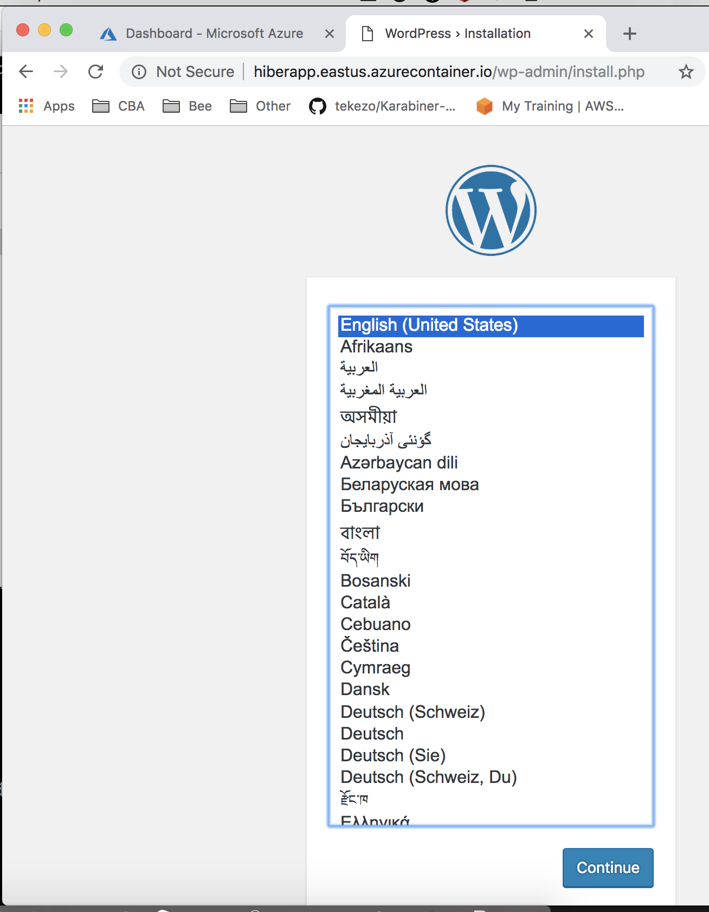

# Overview

Playing/Learning the  Azure ACI API

## Setup Creds

Run the following command to create an AZure Service Principle for this app:

```
az ad sp create-for-rbac -n "<yourname>-<your app name>" -o json --sdk-auth
```

Prefixing your app name with your name makes it easy track app registrations in your Azure AD. The above command will generate something like this:

```
{
  "clientId": "xxxx",
  "clientSecret": "xxxx",
  "subscriptionId": "xxxx",
  "tenantId": "xxxx",
  "activeDirectoryEndpointUrl": "https://login.microsoftonline.com",
  "resourceManagerEndpointUrl": "https://management.azure.com/",
  "activeDirectoryGraphResourceId": "https://graph.windows.net/",
  "sqlManagementEndpointUrl": "https://management.core.windows.net:8443/",
  "galleryEndpointUrl": "https://gallery.azure.com/",
  "managementEndpointUrl": "https://management.core.windows.net/"
}
```


 Use the output to generate a credential file `~/.azure/mycreds`:

```
export AZURE_TENANT_ID=<blah>
export AZURE_CLIENT_ID=<blah>
export AZURE_CLIENT_SECRET=<blah>
export AZURE_SUBSCRIPTION_ID=<blah>
```

## Testing the App

The app deploys a wordpress app

- dot source your creds:

```
~/.azure/mycreds
```

- Run the app

```
go run main.go
```

You should get output similar to:

```
2018/11/16 14:52:22 AZURE_TENANT_ID variable was found. OK.
2018/11/16 14:52:22 AZURE_CLIENT_ID variable was found. OK.
2018/11/16 14:52:22 AZURE_CLIENT_SECRET variable was found. OK.
2018/11/16 14:52:22 AZURE_SUBSCRIPTION_ID variable was found. OK.
2018/11/16 14:52:22 Starting azure auth...
2018/11/16 14:52:22 After azure auth...
2018/11/16 14:52:24 Starting GetContainerGroupFromSpec...
2018/11/16 14:52:24 Starting setTCPPort...
2018/11/16 14:52:24 Starting setTCPPort...
2018/11/16 14:52:24 Created containerGroupProperties
2018/11/16 14:52:24 Created containnerGroup
2018/11/16 14:52:24 AZURE_TENANT_ID variable was found. OK.
2018/11/16 14:52:24 AZURE_CLIENT_ID variable was found. OK.
2018/11/16 14:52:24 AZURE_CLIENT_SECRET variable was found. OK.
2018/11/16 14:52:24 AZURE_SUBSCRIPTION_ID variable was found. OK.
2018/11/16 14:52:24 Starting azure auth...
2018/11/16 14:52:24 After azure auth...
2018/11/16 14:53:33 Deployment completed...
2018/11/16 14:53:34 hiberapp.eastus.azurecontainer.io

```
The last line of the output is the URL to your wordpress app:



